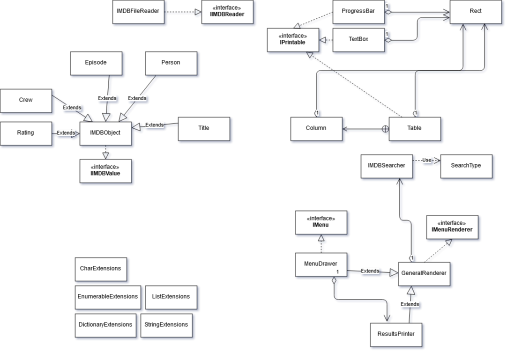

# Projeto para a disciplina "Linguagens de Programação 2"

---

## IMDB Analizer

Da Autoria de:

- Pedro Fernandes, nº 21803791
- Rafael Castro e Silva, nº 21803791

---

### Participação dos membros no projeto (como refletido pelos commits no Git):

- No primeiro commit ([nome do mesmo]) - feito pelo membro Rafael Castro e 
Silva - foi utilizada uma outra conta, "EldirishInquisition".

- O segundo commit, realizado pelo membro Pedro Fernandes, define parte da - 
estrutura geral do protótipo. Criando as classes Render, Census e React, que 
servem - respetivamente - para: escrever instruções para o jogador, verificar e
gerir o input deste e, por fim, para utilizar os inputs do jogador. 

---
### Arquitetura da Solução

- Foram usados, principalmente, dicionários para guardar a informação. Desta maneira é possivel realizar procuras rápidas com o "Where" usando apenas uma "Key" no método TryGetValue do dicionário.
Usamos classes separadas para cada elemento da base de dados implementados por uma interface que os englobe a todos. Desta forma é possivel agregar as classes numa só interface.(ex : IEnumerable...).
Usamos várias interfaces para o código ser mais fléxivel. E também deixamos as classes em aberto i.e. as classes podem ser herditadas para outros programadores implementarem a sua própria solução usando as mesmas.
Para os menus usamos métodos lambda para as ações do menus.
Usamos o pattern Target para a resolução do problema.

#### UML

---

### Referências:

- Nenhuma até ao momento.